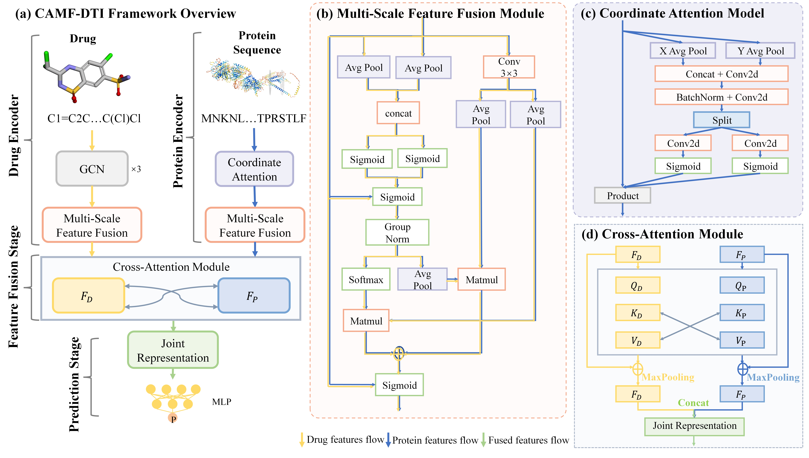

# CAMF-DTI: Coordinated Attention and Multi-scale Feature Fusion for Drug–Target Interaction Prediction

This repository contains the source code for the paper:

**"CAMF-DTI: Enhancing Drug–Target Interaction Prediction via Coordinated Attention and Multi-Scale Feature Fusion"**

## 🔍 Overview

CAMF-DTI is a deep learning framework designed to predict drug–target interactions by integrating:

- **Coordinated Attention**: capturing directional and spatial importance.
- **Multi-Scale Feature Fusion**: aggregating local and global features.
- **Cross-Modality Interaction**: jointly learning from drug and target representations.

## 🧠 Model Architecture

The overall architecture of CAMF-DTI is illustrated below:



## 📁 Directory Structure

```
.
├── main.py             # Entry point to train and evaluate the model
├── CoAtt.py            # Coordinate attention mechanism
├── Interaction.py      # Cross-attention interaction module
├── models.py           # Drug and target encoders
├── trainer.py          # Training and validation logic
├── dataloader.py       # Dataset loading and batching
├── configs.py          # Hyperparameter configurations
├── utils.py            # Utility functions
├── LICENSE             # License file
```

## ⚙️ Requirements

- Python >= 3.7
- PyTorch >= 1.10
- NumPy
- pandas
- scikit-learn
- tqdm

Install dependencies:

```bash
pip install -r requirements.txt
```

## 📊 Datasets

We used the following public datasets:
- **BindingDB**
- **KIBA**
- **Davis**

Due to file size limitations, preprocessed datasets are available at:  
👉 **[[Datasets](https://doi.org/10.5281/zenodo.17035807)]**

You can also preprocess the datasets yourself. See `dataloader.py` and `configs.py` for expected formats and paths.

## 🚀 Running the Model

Train the model:

```bash
python main.py --config configs.py --dataset kiba
```

Key arguments (defined in `configs.py`):
- `dataset`: One of `bindingdb`, `kiba`, `davis`
- `batch_size`, `lr`, `epochs`, etc.

## 📈 Evaluation

The model outputs:
- MSE, CI, Concordance Index
- PRC-AUC and ROC-AUC

Metrics are automatically logged during training.

